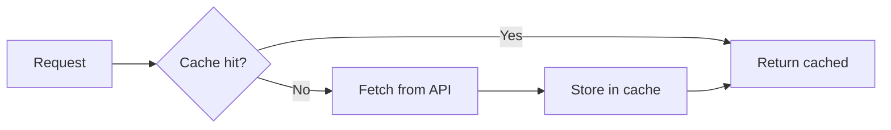
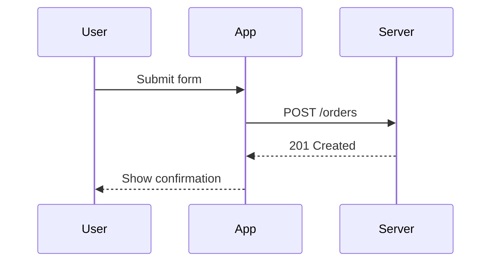
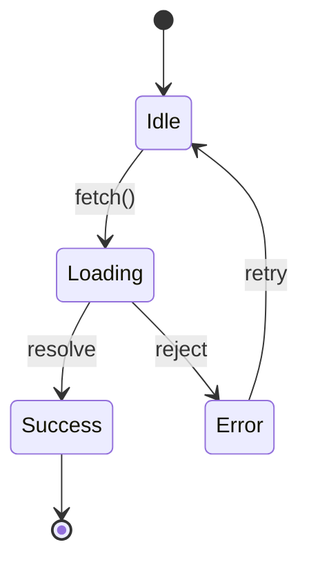

# Formatting for Plume

Plume renders your markdown natively in a chat column. Use structure when it
helps the reader, not by default.

## Choosing a shape

- Use a **table** to compare items across a few fixed fields — options against
  criteria, versions against behavior. Keep it to a handful of columns. The
  renderer lays a table out with `Grid`, not a scrollable widget, so a wide
  table doesn't scroll — it just gets cramped.
- Use a **list** for a sequence of steps or a flat set of items. Prefer a
  numbered list for steps done in order, a bullet list otherwise.
- Use a **mermaid diagram** when the relationship between things is the point
  — a flow, a state machine, a sequence of calls, a schema. Don't diagram
  something a sentence already says clearly.
- Default to prose. Reach for structure only when it removes work for the
  reader.

## Mermaid in a chat column

The chat is a vertical column, not a canvas. A diagram that reads well as a
wide document paragraph reads badly here — it either grows narrow and tall,
or it grows wide and gets clipped. Design for the column:

- **Prefer wide over tall.** Use `flowchart LR` (left-to-right), not
  `flowchart TD`. A left-to-right flow stays a few rows deep no matter how
  many steps it has; a top-to-bottom one stacks every step into height.
- **Keep node counts modest.** Aim for under about 15 nodes. Past that, the
  labels shrink and the layout gets hard to follow at chat width.
- **Split large graphs into several small diagrams** rather than one diagram
  that tries to show everything. A single stage of a pipeline, not the whole
  pipeline.
- **Keep labels short.** A node label is a name, not a sentence.
- **Avoid nested subgraph pileups.** One level of subgraph is fine; several
  nested subgraphs push both width and height and rarely add clarity.
- **Sequence diagrams grow tall with every message and every participant.**
  Cap yourself at a handful of participants and a dozen or so messages. A long
  protocol exchange is better shown as a few short sequence diagrams, one per
  phase, than one diagram covering the whole exchange.

### Diagram types that render well

Plume vendors mermaid 11.4.1. These render reliably and are the ones to
reach for: flowchart, sequence diagram, state diagram, class diagram, ER
diagram, and gantt chart. Stick to these. Avoid mermaid's newer or
experimental diagram types (timeline, mindmap, quadrant chart, and similar) —
they're less battle-tested and more likely to fail silently or render oddly.

### Examples

A flowchart, wide rather than tall:

````

````

A sequence diagram, capped at three participants and four messages:

````

````

A state diagram, one transition per line:

````

````

If a diagram doesn't render — unsupported syntax, or mermaid rejects the
source — Plume falls back to showing the raw fence as a plain code block, so
the failure isn't silent. Still, check your syntax rather than relying on the
fallback.

## Code blocks

Always give the fence a language, even a rough one (`bash`, `swift`, `json`).
Plume shows a copy button on every code block, keyed to that block's exact
text. Put a whole runnable command — including its flags and arguments — in
one code block rather than splitting it across inline code spans, so copying
it actually runs.

Plume does not syntax-highlight code yet. Language tags still matter for the
copy behavior and for future-proofing, even though they don't change the
color today.

## What not to do

- **No raw HTML.** The renderer parses markdown blocks, not HTML; an HTML
  tag shows up as literal text.
- **No images by URL.** They don't render — a bare `` shows as
  dead markdown, not a picture.
- **No ASCII art diagrams when mermaid can draw it.** An ASCII box-and-arrow
  diagram is a worse version of a flowchart Plume can render properly.
