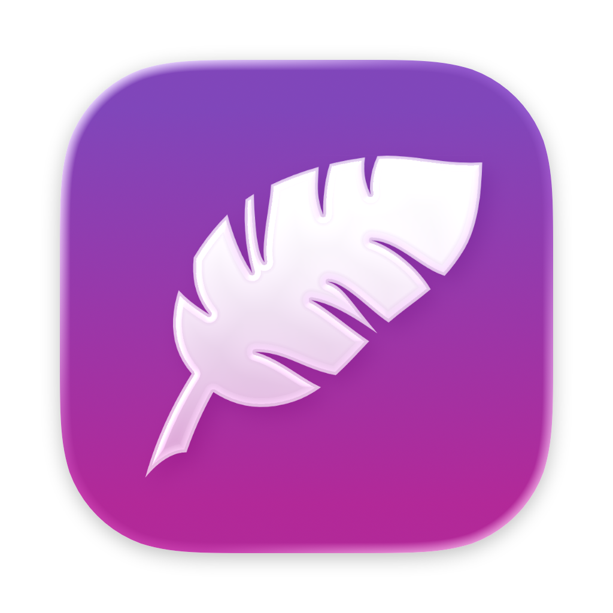

<p align="center">
  
</p>

# Plume

A delightful Mac-native AI coding interface.

Designed for people who jump between Claude Code and Codex sessions and do many things in parallel. It aims for clarity, reliability, and ease of use.

## Why should I use it?

- **Stop staring at the terminal**: Chat with your agents in non-monospaced fonts, with proper UI affordances for plans, questions, permission prompts, slash commands, and more.
- **Switch freely; lose nothing**: Agents and terminals stay running whether or not you're looking at them, and chats auto-resume when Plume or your Mac is restarted. Terminal auto-resume coming soon.
- **Keep your agents running**: Automatically keep your Mac awake when you want it to stay awake. Want to throw your laptop in your bag and remote control from your phone, but stop if your battery gets low or your Mac gets too hot? Done.
- **Stay on top of your agents**: A sidebar with agent, sub-agent, and PR statuses directs your attention where it needs to be. Each task can have multiple tabs of agents and terminals.
- **First-class terminal when you need it**: A [ghostty](https://ghostty.org/)-powered terminal is just a ⌘T away, and the whole interface takes on your ghostty theme.
- **Work your way, with great UX**: There's no prescribed workflow, but smart touches throughout to support however you work. Create your worktree through Plume's UI, or have Claude do it for you in a session; up to you.
- **Your setup comes with you**: Plume drives the same `claude` you already use, so your hooks, skills, settings, and login all carry over. Your ghostty config applies to the terminals.
- **Your data is yours**: Plume runs locally and has no telemetry or server-side features. Any we may add in the future will be opt-in and unobtrusive.

## Requirements

- macOS 26.2 or later
- At least one supported CLI installed and logged in on your login shell’s PATH:
  - [Claude Code](https://claude.com/claude-code) (`claude`)
  - Codex (`codex`) — **beta**, tested with CLI 0.153.4. See [compatibility and limitations](docs/codex-beta.md).
- For GitHub PR features, [`gh` cli](https://cli.github.com/) installed and logged in on your shell's PATH

## Installing

With [Homebrew](https://brew.sh):

```
brew install ryanmoelter/tap/plume
```

Upgrade with `brew upgrade --cask plume`. Plume tells you in-app when an update is available, and its update window can run the upgrade in Terminal for you.

Or download the signed and notarized DMG from the [releases page](https://github.com/ryanmoelter/plume/releases). A DMG install updates itself: use Check for Updates…, or click the "Update Available" row in the sidebar when one shows up.

## Building from source

Open `Plume.xcodeproj` in Xcode 26.2 or later, or build from the command line:

```
xcodebuild -scheme Plume -destination 'platform=macOS' build
```

A Debug build keeps its data separate from an installed release, so the two can run side by side.

## FAQ

### Can I use this with my Claude Pro/Max/Team subscription?

Yes! It uses `claude -p` under the hood, so any way you authenticate the `claude` terminal app works for Plume.

Anthropic's support page [confirms this is a supported use of your plan](https://support.claude.com/en/articles/15036540-use-the-claude-agent-sdk-with-your-claude-plan), and it draws from the same usage pool as the terminal app.

### Is this vibe-coded slop?

This is artisanal slop, thank you very much. It's fully AI-coded, but I've had a heavy hand in the design, architecture, implementation, and testing.

All art (e.g. the icon) was made by me without AI assistance.

Read my [AI Policy here](https://gist.github.com/ryanmoelter/d12c933bd1619224149faac356261a84).

## License

```
Copyright 2026 Ryan Moelter

Licensed under the Apache License, Version 2.0 (the "License");
you may not use this file except in compliance with the License.
You may obtain a copy of the License at

    http://www.apache.org/licenses/LICENSE-2.0

Unless required by applicable law or agreed to in writing, software
distributed under the License is distributed on an "AS IS" BASIS,
WITHOUT WARRANTIES OR CONDITIONS OF ANY KIND, either express or implied.
See the License for the specific language governing permissions and
limitations under the License.
```

[Full license text](LICENSE)
